AC215-RadIQ
==============================

Project Organization
---------
```
.
├── LICENSE
├── README.md
├── data_download.sh
├── docker-compose.yml
├── docker-shell.sh
├── model
│   ├── dataset_mscxr.py
│   ├── health_multimodal
│   └── model.py
├── notebooks
│   └── AC215_RadIQ_EDA.ipynb
├── package-lock.json
├── package.json
├── radiq-app-data
│   ├── ms_cxr
│   ├── ms_cxr.dvc
│   └── visualize
└── src
    ├── __init__.py
    ├── api-service <- Code for App backend APIs
    ├── data-downloader
    ├── data-preprocessor
    ├── data-splitter
    ├── data_extraction.py
    ├── data_pipeline
    ├── deployment <- Code for App deployment to GCP
    ├── distillation
    ├── dummy
    ├── frontend <- Code for App frontend
    ├── optimization
    ├── serverless_training
    └── workflow
```
--------

# AC215 - Interactive X-ray Insight

**Team Members**
Martin Ma, Lily Wang, Frank Cheng, Linglai Chen, Chenbing Wang

**Group Name**
RadIQ

**Project**
This project aims to develop an application that allows patients to better understand their chest X-ray diagnosis through an interactive web interface. By integrating chest X-rays with their associated radiology reports through multi-modal learning, users can highlight any phrases in the report, which would light up the relevant region on the X-ray.

### Milestone 6 ###
In our recent milestone, we achieved significant progress in setting up the deployment process using Ansible. This phase involved navigating several technical challenges. Our model, developed with PyTorch, initially faced compatibility issues with Google Cloud Platform (GCP). After exploring various solutions, we resolved this by aligning Python and Torch versions with GCP's requirements.

The complex structure of our model, with its multiple components spread across different folders, presented another challenge during container deployment to GCP. We addressed this by reorganizing necessary files within the api-service, ensuring a smoother deployment process.

Furthermore, our frontend container's dependency on the Vite build system, as opposed to the more common yarn build, required some adjustments. We successfully modified it to facilitate effective interaction with the api-service after deployment.

These efforts have led to the successful integration of our application on a single GCP Virtual Machine (VM) instance. The application is now operational and can be accessed at http://34.42.139.78.

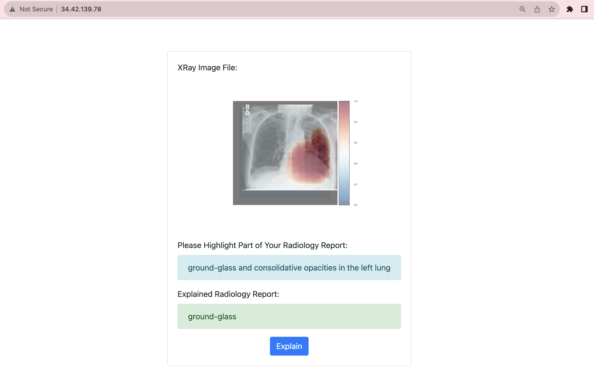

**API Service Container** This container has all the python files to run and expose thr backend apis.

To run the container locally:

- Open a terminal and go to `/src/api-service`
- Run `sh docker-shell.sh`
- Once inside the docker container run `uvicorn_server`
- To view and test APIs go to `http://localhost:9000/docs`

**Frontend Container** This container contains all the files to develop and build the app frontend. There are dockerfiles for both development and production

To run the container locally:

- Open a terminal and go to `/src/frontend`
- Run `sh docker-shell.sh`
- If running the container for the first time, run `yarn install`
- Once inside the docker container run `yarn run build`, which actually makes use of the vite build into the `/dist` folder.
- Go to `` to access the app locally

**Deployment Container** This container helps manage building and deploying all our app containers. The deployment is to GCP and all docker images go to GCR.

To run the container locally:

- If any changes are made to the frontend container, go into the frontend container and run `yarn run build`
- Open a terminal and go to `/src/deployment`
- Run `sh docker-shell.sh`
- Build and Push Docker Containers to GCR (Google Container Registry) `ansible-playbook deploy-docker-images.yml -i inventory.yml`
- …
- 
### Milestone 5 ###

**App Design**


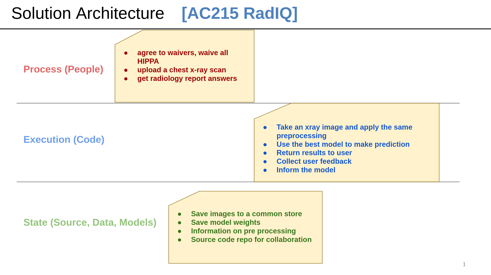


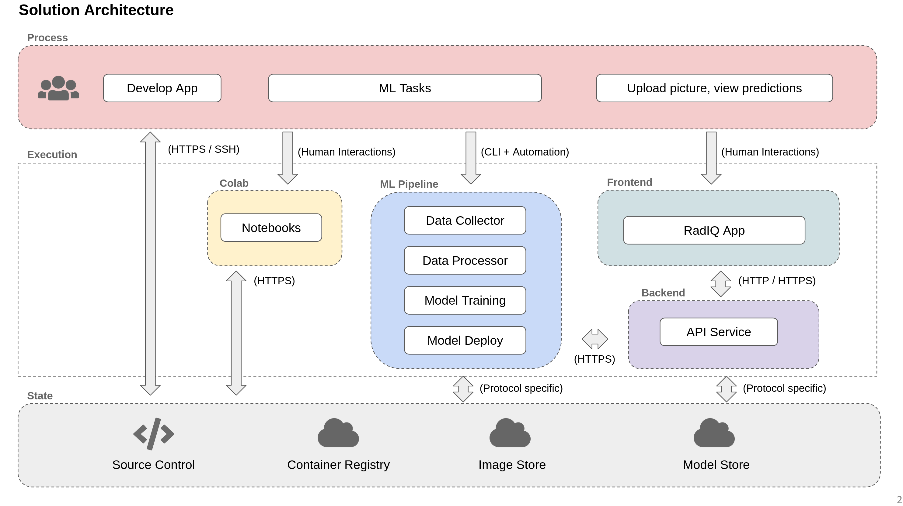


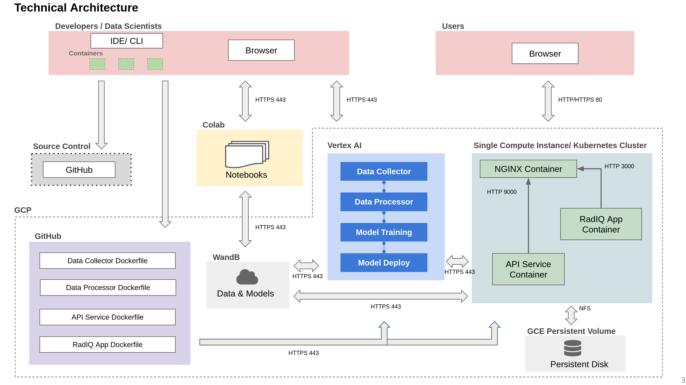

**API-service Implementation**

Building on top of milestone 1-4, we created an `InferenceEngine` class to abstract away the details of the model and to handle the inference process. Specifically, the `__init__` method loads the model and downloads the best checkpoint from wandb. The `inference` method takes in a text prompt and an image, preprocess the inputs, run the model, and returns the heatmap overlaid on top of the original image.

Furthermore, FastAPI is used to create an API endpoint that takes in a text prompt and an image, and returns the heatmap overlaid on top of the original image. The two main methods are `startup_event` and `predict`. On `startup_event`, the server will call the `__init__` method of the `InferenceEngine` class. On `predict`, the server will call the `inference` method.


**Frontend Implementation**

The frontend is implemented as a simple React app with only one route, using React hooks for simple state management. Below is a simple demo:

https://github.com/ai-xiaihai/AC215_RadIQ/assets/12586770/c5a6bfe6-f057-41cb-bbb8-9cef3140b7e5

**APIs & Frontend Integration**

The frontend and API are integration are done through common I/O formats. The frontend sends a POST request to the API endpoint with the following JSON format:
```
{
    "text": "text prompt",
    "image": "base64 encoded image"
}
```

The API endpoint returns the heatmap in the following format:
```
heatmap: "base64 encoded heatmap"
```

**Deployment**

The overview below outlines our deployment process for a two-container application on Google Cloud Platform (GCP) using Ansible. The application features a frontend for X-ray image and radiology report interactions, and an API service for model predictions.

Key Components
* GCP API Setup: Essential GCP APIs like Compute Engine, Cloud Resource Manager, and Container Registry are enabled for integration.
* Service Accounts: Two GCP service accounts ('deployment' and 'gcp-service') are created for deployment and storage management, with appropriate roles and private key configurations.
* Docker and Ansible Integration: A Docker container encapsulating Ansible and other necessary tools is used to standardize the deployment process.
* SSH Configuration: SSH keys are generated and configured for secure communication with GCP instances.
* Ansible Automation: Ansible playbooks automate various stages of deployment, including:
    * Docker image building and pushing to Google Container Registry.
    * Compute instance creation and provisioning on GCP.
    * Docker container setup on the compute instance.
    * Web server configuration and setup.

Here is our deployed app on a single VM in GCP:

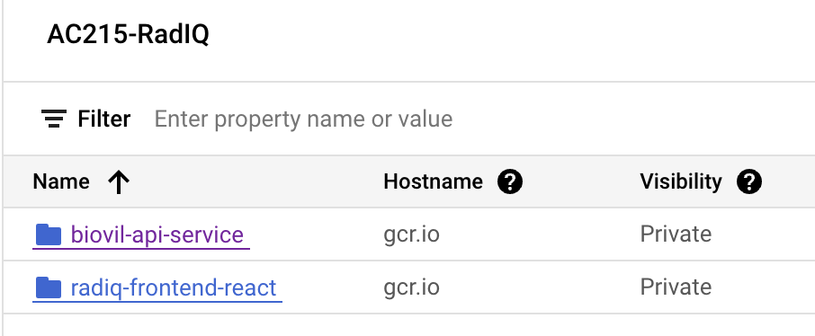

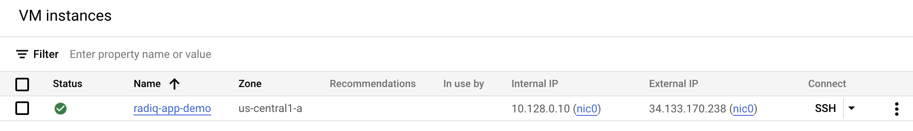

### Milestone 4 ###

**Model Optimization**

In the previous milestone, we focused on customizing the advanced BioVil model—a prominent self-supervised vision-language model—for the specialized task of predicting box coordinates within images, guided by text descriptions. The BioVil model is particularly adept at creating image and text embeddings and utilizes these to compute a cosine similarity map. However, we were stuck at subpar model performance. 

In our latest milestone, we embarked on a systematic exploration to enhance our model's efficacy, experimenting with various architectural modifications and loss function optimizations. By iterating through different model architectures and tweaking loss functions, we aimed to pinpoint a more suitable framework that could produce more precise box coordinate predictions in response to textual prompts. This phase of our work was marked by rigorous testing and analysis, laying down a path toward achieving improved model accuracy and efficiency in subsequent iterations.

***Architecture 1: Interpolation and Binary Cross Entropy Loss***

We initiated our experiment by employing basic interpolation techniques to upscale the cosine similarity map to the original image dimensions. The rationale was to maintain structural integrity while facilitating compatibility with the image size. We then applied a binary cross entropy loss, allowing BioVil's encoder and decoder to train freely.

`> Issue: The loss remained stagnant. This stagnation indicated that the model was not learning, likely because the interpolated data failed to retain essential information for accurate box coordinate prediction, rendering the model ineffective.
`

***Architecture 2: Fully Connected Layers for Direct Coordinate Output***

To address the interpolation issue, we shifted our strategy. Instead of resizing, we integrated several fully connected (FC) layers post-similarity map to predict coordinates directly. This alteration was based on the presumption that bypassing interpolation would enable the model to focus on essential features relevant for coordinate prediction.
    
`> Issue: Although the loss showed movement, indicating some degree of learning, the overall performance was unsatisfactory. The direct method, while circumventing the interpolation problem, likely lacked spatial context or sufficient feature representation necessary for precise coordinate prediction.
`

***Architecture 3: Convolutional Layers for Resizing and Binary Cross Entropy Loss***

Given the inadequacies in the prior structures, we adopted convolutional layers to resize the similarity map. Convolutional layers were chosen for their proficiency in handling image data and preserving spatial information, expected to enhance the learning of coordinate positions. We continued with binary cross entropy as the loss function.

`> Issue: This model showed improvement, confirming that using convolution for resizing preserved more critical information. However, the performance still wasn't optimal, suggesting potential issues like the model not effectively differentiating between classes of varying difficulty.
`

***Architecture 4: Implementation of Focal Loss***

We hypothesized that the underwhelming performance could be due to class imbalance – a common complication where models struggle to recognize minority classes. To mitigate this, we introduced focal loss, known for addressing class imbalance by giving more weight to harder-to-classify instances.

`> Outcome: The results were promising: we achieved a Dice Score of 0.43, the highest in our series of tests. This score is indicative of a significant improvement in the model's ability to predict box coordinates accurately.
`

**Model Training**

Besides model architecture, we also made strategic advancements in both the evaluation methodology and model training enhancements, particularly through hyperparameter tuning and visualization through WandB. These steps are critical to refining our model's performance in predicting box coordinates on images based on text prompts.

***Evaluation Methodology***

- Objective: Our evaluation process is distinct from the training procedure, necessitating the introduction of a specific threshold selection to assess model performance accurately. We convert the model-generated heatmaps and ground truth boxes into binary masks. The need for an appropriate threshold is crucial here, as it transforms our heatmap into a binary format, suitable for direct comparison with the binary mask of the ground truth box. The Dice score serves as our evaluation metric, offering a clear measure of the model’s prediction accuracy by comparing the similarity between the generated binary mask and the ground truth.

- During inference, we can tune the threshold to optimize dice value on the validation set, as shown in the figure below. Once the optimal threshold has been chosen, the performance can be evaluated on the test set.

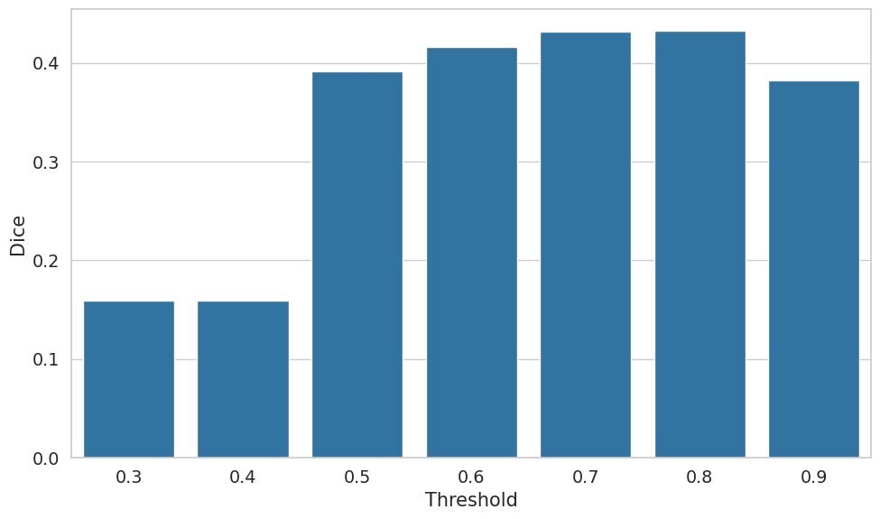

***Enhanced Training via WandB***

- Hyperparameter Optimization: We utilize WandB’s automatic hyperparameter sweep functionality, configured through 'config.yaml'. This approach allows us to methodically iterate over various crucial parameters, including learning rate, batch size, and the focal loss ratio (determining the weighting towards our class of interest versus the background). 
- Visualization and Debugging: we leverage WandB's image logging feature for an in-depth visual analysis of model performance. By logging the heatmaps produced by our model alongside the corresponding ground truth boxes and text prompt, we gain valuable real-time insights into the model’s operational status during training phases. Notably, we observed that higher concentration regions within the heatmaps tend to cluster more accurately within the ground truth boxes as training progresses. This method of visualization not only aids in immediate performance assessment but also serves as a powerful debugging tool, helping identify and rectify issues dynamically, thereby ensuring consistent model improvement.

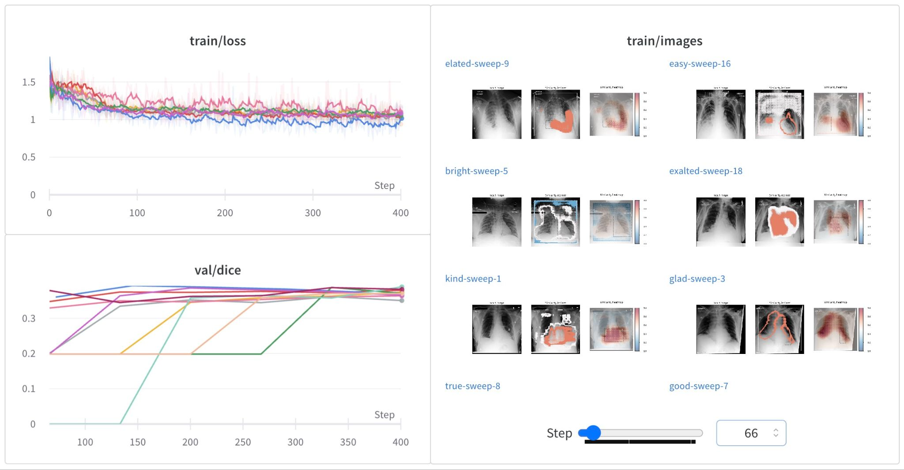

**Kubeflow**
- We set up a complete ML workflow (in *src/workflow*) that executes three tasks: image preprocessing, splitting, and serverless training. Each task is executed by a Docker Container, which contains a cli.py file that gives developers flexibility to control the subtasks. The *cli.py* in *src/workflow* allows us to complete all tasks in one line.
- How to run the workflow:
    (a) Enter *src/workflow* and run __./Docker-shell.sh__;
    (b) Run __Python cli.py__ with options. Options include:
    1. __-p__: download raw data from GCP bucket; preprocess the data; and upload the preprocessed data to GCP bucket
    2. __-s__: download preprocessed data from GCP bucket; split the data; and upload the splitted data to GCP bucket
    3. __-m__: download splitted data from GCP bucket; train the model on Vertex AI
    4. __-a__: execute all above tasks in the workflow. 
- More flexible operations can be found inside the containers that handle multiple subtasks. For instance, if we simply want to download the raw images from GCP bucket, we can go to *src/data-preprocessor*, run *./Docker-shell.sh* and run *python cli.py -d* inside container to download data.

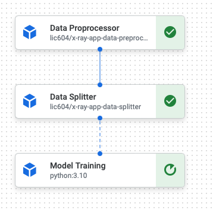

**Model Distillation**
- Since our model has several components, we first identified the bottleneck in inference speed and memory. We found that the image encoder (ResNet50-based) is the bottleneck. The image encoder part of the multimodal model is ~6x slower than the (BERT-based) text encoder during inference. We trained a ResNet18-based student model by model distillation.
- Following the distillation process in lecture 9 and trained for 5 epochs, the number of parameters decreased by 46%, the inference time decreassed by ~50%; the dice scored decreased by 2%. The final dice score of 0.386 after model distillation, compared to 0.393 in the teacher model.
- Although we consider the model distillation to be successful with ~50% decrease in number of parameters and inference time, at the cost of only 2% drop in dice, we decided not to use the distilled model in our web application. The reason is that the distilled model is not as accurate as the teacher model. We believe that the accuracy is more important than the inference time in medical application.

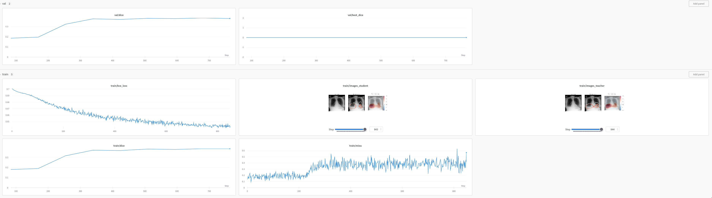


### Milestone 3 ###

**Data Loading**

In this milestone, we undertook significant refinements to optimize our data pipeline process. 
1. Initially, we created a shell script to retrieve data from the GCP bucket. While this approach was functional, it was far from optimal, putting undue strain on memory / disk resources, and it's not scalable.
2. Recognizing this inefficiency, we refactored this process to use the `google-cloud-storage` library to mount the data directly from GCP. This change required an intricate understanding of cloud resources and a redesign of our data management strategy, but it enabled us to achieve more efficient data loading for training. Note that this is not part of the curriculum, but we decided to take on this challenge to improve our project and allow more people to use it.

As a quick experiment, we first used the following script to verify that our docker can list out all the files in the GCP bucket:
```python
from google.cloud import storage

def list_blobs(bucket_name, prefix=None):
    """Lists all the blobs in the bucket."""
    storage_client = storage.Client()
    bucket = storage_client.bucket(bucket_name)
    
    blobs = bucket.list_blobs(prefix=prefix)

    for blob in blobs:
        print(blob.name)

if __name__ == "__main__":
    bucket_name = "radiq-app-data"
    prefix = "ms_cxr/"
    list_blobs(bucket_name, prefix)
```

**Modelling**

On the modelling, we decided to work with the state-of-the-art biomedical vision-language model, `BioViL`, published by Microsoft in 2022.
Although the pretrained weights are givne, adapting such an advanced model to our specific needs presented its own set of challenges. We undertook the task of modifying and fine-tuning this model to our dataset. Our objective was nuanced – predicting box coordinates corresponding to text prompts. We first ensured that it worked on the virtual environment using pipenv. Further complicating our task was the need to ensure compatibility and efficiency within a containerized environment. To seamlessly integrate this with Docker, we meticulously crafted both the Pipfile and Dockerfile, ensuring that all dependencies and configurations were precisely aligned.

Since the SOTA model is in PyTorch, our dataloader is also generated in PyTorch. Similar to TensorFlow's `tf.data` (what we seen in class), PyTorch's `DataLoader` is another robust tools to efficiently manage data for deep learning.

**Experiment Tracking**

Below you can see the output from our Weights & Biases page. We used this tool to track several iterations of our model training. It was tracked using the `wandb` library we included inside of our `src/data_pipeline/main.py` script.

**Vertex AI**

To allow serverless training, we adopt Google Cloud's Vertex AI. With this, we can easily train our model on the cloud without worrying about the infrastructure. We also use Vertex AI to deploy our model as an API endpoint. This allows us to easily integrate our model with our web application. Note that we have not been able to get GPU Quotas, so we are running with CPU only. Hopefully, we can get GPU Quotas soon and significantly speed up our training process.

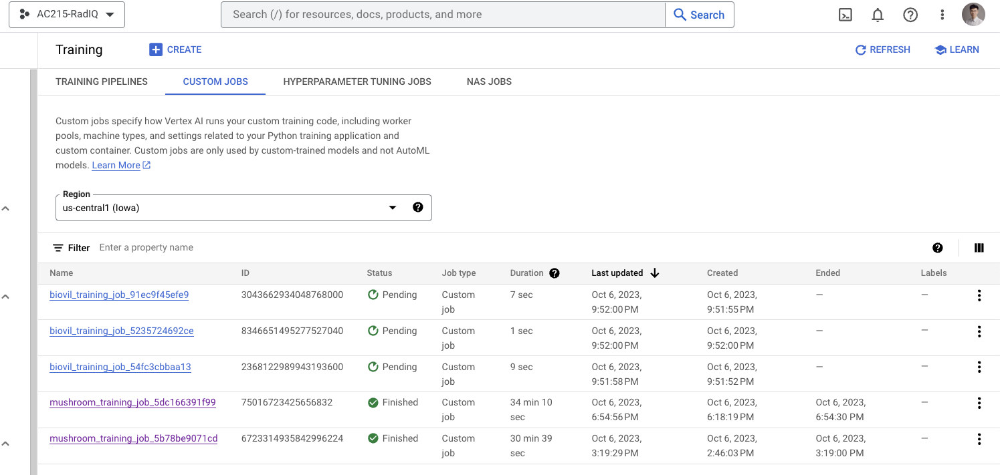

Furthermore, we have a fully functional docker container as well. This allows us to easily deploy our model on any cloud platform, including AWS, Azure, and GCP. To this date, we have 2 tools behind our belt - a containerized training pipeline to run on compute nodes and Vertex AI.


**Docker Setup**
- Milstone 3
    - A Dockerfile is created inside /src/data_pipeline.
- Milestone 2
    - Two Dockerfiles are created in /src/data_preprocessing and /src/data_splitting. They are used to create a 
      container for data preprocessing and data splitting, respectively. All docker services are managed in 
      /src/docker-compose.yml. To start a service listed in docker-compose.yml, run `docker-compose up <service-name>` 
      on the root level directory. 
    - For data preprocessing and data splitting service, we can also run an interactive terminal. To do this, run 
      `docker-compose run --entrypoint /bin/sh <service-name>` on the root level.

**Preprocess container**
- This container reads image data, resize them into a common size (e.g., 1024 x 1024), resize the ground-truth bounding box labels, and stores both images and ground-truth label file back to GCP.
- The input of this container includes the dimension of the resized image, the path to the image data, the path to the ground-truth label file, and the path to store the downsized image data.


**Split container**
- This container splits the data into training, validation, and testing sets.
- The input of this container includes the path to the image data, and the path to the ground-truth label file.


**Data pipline (model training) container**
- Ensure you have the secret file `secrets/data-service-account.json` before running the container. Once inside the container, you can execute `bash data_download.sh` to download the data from our GCP bucket.
- At root, run `bash docker-shell.sh`
- Inside the container, go to `src/data_pipeline`, run `python3 main.py --log_to_wandb True` to train the model. This script implements `torch.utils.data.Dataset` and `torch.utils.data.DataLoader` to enhance data ingestion and management within machine learning components of the project. Then it loads model architecture stored in `/model` and fits the model. It takes the following key arguments:
    > --log_to_wandb\[bool\]: Flag to log results to wandb, default is False

**Data Verison Control**
- We use [DVC](https://dvc.org) to version our dataset. The metadata file is located in `radiq-app-data/`. There is also a remote copy on google cloud storage at `gs://radiq-app-data/dvc_store/`.

**Useful commands to send data to GCP bucket**
- Look at data in gcp bucket: `gsutil ls gs://radiq-app-data/ms_cxr/`
- Copy a single file from local to gcp bucket: `gsutil cp label.csv gs://radiq-app-data/ms_cxr/`
- Copy a folder from local to gcp bucket: `gsutil -m cp -r raw/ gs://radiq-app-data/ms_cxr/`
