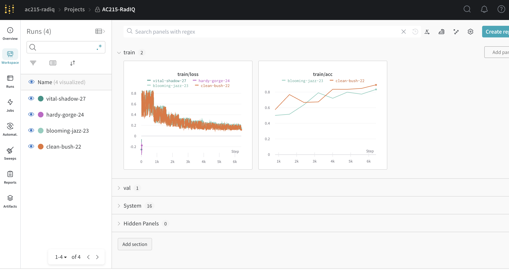

AC215-RadIQ
==============================

Project Organization
---------
```
.
├── LICENSE
├── README.md
├── advanced_training
│   └── wandb_demo.py
├── data_download.sh
├── docker-compose.yml
├── docker-shell.sh
├── images
│   └── wandb.png
├── model
│   ├── health_multimodal <- this directory includes all components that model.py need
│   └── model.py
├── notebooks
│   └── AC215_RadIQ_EDA.ipynb
├── radiq-app-data
└── src
    ├── __init__.py
    ├── data_extraction.py
    ├── data_pipeline
    │   ├── Dockerfile
    │   ├── Pipfile
    │   ├── Pipfile.lock
    │   ├── data_download.sh
    │   └── main.py
    ├── data_preprocessing
    │   ├── Dockerfile
    │   ├── Pipfile
    │   └── data_preprocessing.py
    └── data_splitting
        ├── Dockerfile
        ├── Pipfile
        └── data_splitting.py

```
--------

# AC215 - Interactive X-ray Insight

**Team Members**
Martin Ma, Lily Wang, Frank Cheng, Linglai Chen, Chenbing Wang

**Group Name**
RadIQ

**Project**
This project aims to develop an application that allows patients to better understand their chest X-ray diagnosis through an interactive web interface. By integrating chest X-rays with their associated radiology reports through multi-modal learning, users can highlight any phrases in the report, which would light up the relevant region on the X-ray.

### Milestone 4 ###

**Model Optimization**
- Encoder vs decoder
- Loss function

**Model Training**
- WandB automatic hyperparameter sweep through config.yaml
- WandB image logging feature to visualize model performance / debugging

**Kubeflow**

**Model Distillation**
- Since our model has several components, we first identified the bottleneck in inference speed and memory. We found that the image encoder (ResNet50-based) is the bottleneck. The image encoder part of the multimodal model is ~6x slower than the (BERT-based) text encoder during inference. We trained a ResNet18-based student model by model distillation.
- Following the distillation process in lecture 9 and trained for 5 epochs, the number of parameters decreased by 46%, the inference time decreassed by ~50%; the dice scored decreased by 2%. The final dice score of 0.386 after model distillation, compared to 0.392 in the teacher model.
- Although we consider the model distillation to be successful with ~50% decrease in number of parameters and inference time, at the cost of only 2% drop in dice, we decided not to use the distilled model in our web application. The reason is that the distilled model is not as accurate as the teacher model. We believe that the accuracy is more important than the inference time in medical application.


### Milestone 3 ###

**Data Loading**

In this milestone, we undertook significant refinements to optimize our data pipeline process. 
1. Initially, we created a shell script to retrieve data from the GCP bucket. While this approach was functional, it was far from optimal, putting undue strain on memory / disk resources, and it's not scalable.
2. Recognizing this inefficiency, we refactored this process to use the `google-cloud-storage` library to mount the data directly from GCP. This change required an intricate understanding of cloud resources and a redesign of our data management strategy, but it enabled us to achieve more efficient data loading for training. Note that this is not part of the curriculum, but we decided to take on this challenge to improve our project and allow more people to use it.

As a quick experiment, we first used the following script to verify that our docker can list out all the files in the GCP bucket:
```python
from google.cloud import storage

def list_blobs(bucket_name, prefix=None):
    """Lists all the blobs in the bucket."""
    storage_client = storage.Client()
    bucket = storage_client.bucket(bucket_name)
    
    blobs = bucket.list_blobs(prefix=prefix)

    for blob in blobs:
        print(blob.name)

if __name__ == "__main__":
    bucket_name = "radiq-app-data"
    prefix = "ms_cxr/"
    list_blobs(bucket_name, prefix)
```

**Modelling**

On the modelling, we decided to work with the state-of-the-art biomedical vision-language model, `BioViL`, published by Microsoft in 2022.
Although the pretrained weights are givne, adapting such an advanced model to our specific needs presented its own set of challenges. We undertook the task of modifying and fine-tuning this model to our dataset. Our objective was nuanced – predicting box coordinates corresponding to text prompts. We first ensured that it worked on the virtual environment using pipenv. Further complicating our task was the need to ensure compatibility and efficiency within a containerized environment. To seamlessly integrate this with Docker, we meticulously crafted both the Pipfile and Dockerfile, ensuring that all dependencies and configurations were precisely aligned.

Since the SOTA model is in PyTorch, our dataloader is also generated in PyTorch. Similar to TensorFlow's `tf.data` (what we seen in class), PyTorch's `DataLoader` is another robust tools to efficiently manage data for deep learning.

**Experiment Tracking**

Below you can see the output from our Weights & Biases page. We used this tool to track several iterations of our model training. It was tracked using the `wandb` library we included inside of our `src/data_pipeline/main.py` script.


**Vertex AI**

To allow serverless training, we adopt Google Cloud's Vertex AI. With this, we can easily train our model on the cloud without worrying about the infrastructure. We also use Vertex AI to deploy our model as an API endpoint. This allows us to easily integrate our model with our web application. Note that we have not been able to get GPU Quotas, so we are running with CPU only. Hopefully, we can get GPU Quotas soon and significantly speed up our training process.


Furthermore, we have a fully functional docker container as well. This allows us to easily deploy our model on any cloud platform, including AWS, Azure, and GCP. To this date, we have 2 tools behind our belt - a containerized training pipeline to run on compute nodes and Vertex AI.


**Docker Setup**
- Milstone 3
    - A Dockerfile is created inside /src/data_pipeline.
- Milestone 2
    - Two Dockerfiles are created in /src/data_preprocessing and /src/data_splitting. They are used to create a 
      container for data preprocessing and data splitting, respectively. All docker services are managed in 
      /src/docker-compose.yml. To start a service listed in docker-compose.yml, run `docker-compose up <service-name>` 
      on the root level directory. 
    - For data preprocessing and data splitting service, we can also run an interactive terminal. To do this, run 
      `docker-compose run --entrypoint /bin/sh <service-name>` on the root level.

**Preprocess container**
- This container reads image data, resize them into a common size (e.g., 1024 x 1024), resize the ground-truth bounding box labels, and stores both images and ground-truth label file back to GCP.
- The input of this container includes the dimension of the resized image, the path to the image data, the path to the ground-truth label file, and the path to store the downsized image data.


**Split container**
- This container splits the data into training, validation, and testing sets.
- The input of this container includes the path to the image data, and the path to the ground-truth label file.


**Data pipline (model training) container**
- Ensure you have the secret file `secrets/data-service-account.json` before running the container. Once inside the container, you can execute `bash data_download.sh` to download the data from our GCP bucket.
- At root, run `bash docker-shell.sh`
- Inside the container, go to `src/data_pipeline`, run `python3 main.py --log_to_wandb True` to train the model. This script implements `torch.utils.data.Dataset` and `torch.utils.data.DataLoader` to enhance data ingestion and management within machine learning components of the project. Then it loads model architecture stored in `/model` and fits the model. It takes the following key arguments:
    > --log_to_wandb\[bool\]: Flag to log results to wandb, default is False

**Data Verison Control**
- We use [DVC](https://dvc.org) to version our dataset. The metadata file is located in `radiq-app-data/`. There is also a remote copy on google cloud storage at `gs://radiq-app-data/dvc_store/`.

**Useful commands to send data to GCP bucket**
- Look at data in gcp bucket: `gsutil ls gs://radiq-app-data/ms_cxr/`
- Copy a single file from local to gcp bucket: `gsutil cp label.csv gs://radiq-app-data/ms_cxr/`
- Copy a folder from local to gcp bucket: `gsutil -m cp -r raw/ gs://radiq-app-data/ms_cxr/`
