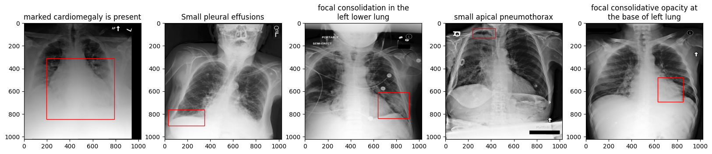
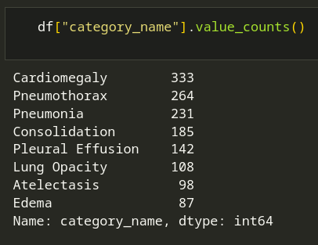

# A Platform for Interactive Medical Image Interpretation

## Motivation

Imagine a generalist medical AI (GMAI) assistant — long been the dream of many patients and doctors. This assistant can interact with patients, help them understand their cases better, and give personalized suggestions. After a medical exam and before going into the doctor’s office, patients already have a basic understanding of their case, this assistant can improve hospital resources efficiency, enabling doctors to tackle more pressing challenges. In rural areas and third-world countries, where medical resources are scarce, this medical assistant can improve accessibility and equality, allowing everyone to reach medical specialists.

In this project, we would like to make a step towards GMAI through a grounded radiology report. More specifically, we aim to build an app that allows patients to better understand their chest X-ray diagnosis through an interactive web interface. By integrating chest X-rays with their associated radiology reports through multi-modal learning, users can highlight any phrases in the report by hovering over their mice, and the corresponding region in the medical image would light up, as shown in the following figure.

## Dataset

### Dataset description

There are 2 relevant datasets for this project, summarized in the following figure.

MIMIC-CXR (Medical Information Mart for Intensive Care — Chest X-rays) is a large, publicly available dataset of chest X-rays and associated radiology reports [4]. Developed by the MIT Laboratory for Computational Physiology and collaborators, MIMIC-CXR contains more than 220,000 radiographic studies from over 60,000 patients. Each X-ray image is linked to a de-identified radiology report, which includes free-text findings and impressions.

MS-CXR (Local Alignment Chest X-ray dataset) is a novel, publicly available dataset designed to facilitate the study of complex semantic modeling in biomedical vision-language processing [5]. Created by a team of researchers and board-certified radiologists, MS-CXR offers 1,153 image-sentence pairs of bounding boxes and corresponding phrases, encompassing eight different cardiopulmonary radiological findings with a roughly equal number of pairs for each finding. The dataset is derived from the public MIMIC-CXR dataset, and the annotations focus on locally-aligned phrase grounding.

Due to computational limitations in this project, we will not pre-train a multimodal model on a large dataset such as MIMIC-CXR. Instead, we will be adopting a foundation medical model, pre-trained on MIMIC-CXR, and using MS-CXR only for finetuning.

### Data preprocessing

In our project, the data processing procedures are containerized. This encapsulation encompasses tasks such as data downloading, resizing, normalization, and splitting. Both raw and processed data are securely stored on the Google Cloud Platform (GCP), ensuring easy retrieval and maintaining reproducibility.

Elevating our approach beyond the standard curriculum, we built a dataset class and dataloader to directly pull data from GCP bucket using google-cloud-storage package. This method effectively bypasses the need to first download data locally, offering two significant advantages:

 1. It addresses the common issue of data versioning among developers. This aspect is crucial in industrial projects where a large number of machine learning engineers (dozens or even hundreds) concurrently experiment with different models on the same database. With our approach, when the central database releases a new version, developers automatically access the most updated data during their training sessions. This ensures consistency and accuracy across various developmental stages.

 2. Our method is particularly beneficial for handling large-scale databases. In an era where machine learning increasingly focuses on big data, databases can scale up to terabytes. Downloading such massive volumes of data locally, or even on a remote server, is impractical. Our approach mitigates this challenge by enabling scalable access to data — fetching only what the model requires at a given time. This not only saves storage space but also enhances efficiency in data handling.

### Exploratory data analysis (EDA)

After finished the data preprocessing, we performed EDA. Our dataset contains 1448 tuples of (text, image, ground_truth_box). All the images have resolution 1024x1024.

We also plotted some samples of our dataset:

In our dataset, each box is defined by a tuple consisting of (x, y, w, h). The area delineated by this box corresponds to the text label (positioned above the images in the plot).

Here is the distribution of the diseases in our dataset:

## Model development

### Related work

In this section, we outlined the state-of-the-art work in the related field. We believe our project is both timely and feasible, considering the recent papers and technologies in the field.

* **CheXzero**: This is a CLIP-based, self-supervised model designed for chest X-rays. Its primary functionality revolves around associating X-ray images with their corresponding reports, focusing mainly on classification rather than segmentation [1].

* **BioViL**: Building upon CheXzero’s foundation, BioViL introduces open-vocabulary segmentation capabilities. However, it achieves a modest mIoU of 0.22, primarily constrained by the limited size of the dataset it utilizes [2].

* **Biomed CLIP**: This recent publication boasts the compilation of the largest public biomedical dataset, extracting 15 million figure-caption pairs from research articles in PubMed Central. Despite its vast yet noisy dataset, the paper reported state-of-the-art performance on numerous biomedical vision-language tasks. Notably, there was no specific mention of its efficacy in open-vocabulary segmentation [3].

We aspire to utilize and expand upon the concepts and models mentioned above as the foundation for our project.

### Model architecture

At a high level, our model comprises 4 primary components: an image encoder, a text encoder, and a deconvolution decoder, as illustrated in the accompanying figure.

* **Image encoder**: An image is passed through this encoder to generate image embedding, represented as a tensor of shape $(\hat{H}, \hat{W}, d)$.

* **Text encoder**: A text prompt is passed through this encoder to generate text embedding, which is also a tensor but with shape $(1, d)$.

* **Cosine similarity and deconvolution**: A similarity map is generated by calculating the cosine similarity between the image and text embeddings, resulting in a tensor of shape $(\hat{H}, \hat{W})$. This similarity map is subsequently passed through a deconvolution layer to upscale to the original image dimensions, resulting in a tensor of shape $(H, W)$. Considering that cosine similarity values range from -1 to 1, we apply a sigmoid function to transform these into probability values between 0 and 1.

Initially, our approach involved fine-tuning the image and text encoders without a decoder. In essence, we linearly projected the cosine similarity map back to the original image dimensions. However, this method did not yield significant performance improvements, suggesting that the encoders were already adept at capturing the necessary information. This insight led us to integrate a decoder to transform the embeddings into a segmentation mask.

Our initial choice for the loss function was binary cross-entropy (BCE). However, we encountered issues due to class imbalance (foreground vs background), which adversely affected the model’s performance. This challenge prompted us to transition to focal loss, a more advanced variant of BCE. In focal loss, the parameters $\alpha$ and $\gamma$ are critical hyperparameters that depend on the class sample ratio and the difficulty of classifying an object.

### Evaluation metric

Our evaluation process is distinct from the training procedure, necessitating the introduction of a specific threshold selection to assess model performance accurately. We convert the model-generated heatmaps and ground truth boxes into binary masks. The need for an appropriate threshold is crucial here, as it transforms our heatmap into a binary format, suitable for direct comparison with the binary mask of the ground truth box. The Dice score serves as our evaluation metric, offering a clear measure of the model’s prediction accuracy by comparing the similarity between the generated binary mask and the ground truth.

During inference, we can tune the threshold to optimize the dice value on the validation set, as shown in the figure below. Once the optimal threshold has been chosen, the performance can be evaluated on the test set.

### Model distillation

- Since our model has several components, we first identified the bottleneck in inference speed and memory. We found that the image encoder (ResNet50-based) is the bottleneck. The image encoder part of the multimodal model is ~6x slower than the (BERT-based) text encoder during inference. We trained a ResNet18-based student model by model distillation.
- Following the distillation process in lecture 9 and trained for 5 epochs, the number of parameters decreased by 46%, the inference time decreassed by ~50%; the dice scored decreased by 2%. The final dice score of 0.386 after model distillation, compared to 0.393 in the teacher model.
- Although we consider the model distillation to be successful with ~50% decrease in number of parameters and inference time, at the cost of only 2% drop in dice, we decided not to use the distilled model in our web application. The reason is that the distilled model is not as accurate as the teacher model. We believe that the accuracy is more important than the inference time in medical application.

### WandB
In our project, we have significantly enhanced the training of our experiment by incorporating [WandB](https://wandb.ai/site), a robust tool that offers both hyperparameter optimization and advanced visualization capabilities.
* **Hyperparameter Optimization**: We utilize WandB’s automatic hyperparameter sweep functionality, configured through 'config.yaml'. This approach allows us to methodically iterate over various crucial parameters, including learning rate, batch size, and the focal loss ratio (determining the weighting towards our class of interest versus the background).
* **Visualization and Debugging**: we leverage WandB's image logging feature for an in-depth visual analysis of model performance. By logging the heatmaps produced by our model alongside the corresponding ground truth boxes and text prompt, we gain valuable real-time insights into the model’s operational status during training phases. Notably, we observed that higher concentration regions within the heatmaps tend to cluster more accurately within the ground truth boxes as training progresses. This method of visualization not only aids in immediate performance assessment but also serves as a powerful debugging tool, helping identify and rectify issues dynamically, thereby ensuring consistent model improvement.

### Kubeflow
- To automate our model training workflow, we set up Kubeflow scripts to excute all the tasks on Vertex AI Pipelines. This allows us to easily re-run our ML pipeline when there is change in our data or model architecture. Our workflow includes three tasks: image preprocessing, data splitting, and serverless training. All tasks are continaerized using Docker. Once executed, Vertex AI will excute these tasks sequentially (screenshot below).  
- We created a cli.py file that gives developers flexibility to control the subtasks. To run the workflow, we only need the following simple commands: 
    (a) Enter *src/workflow* and run __./Docker-shell.sh__;
    (b) Run __Python cli.py__ with options. Options include:
    1. __-p__: download raw data from GCP bucket; preprocess the data; and upload the preprocessed data to GCP bucket
    2. __-s__: download preprocessed data from GCP bucket; split the data; and upload the splitted data to GCP bucket
    3. __-m__: download splitted data from GCP bucket; train the model on Vertex AI
    4. __-a__: execute all above tasks in the workflow. 
- More flexible operations can be found inside the containers that handle multiple subtasks. For instance, if we simply want to download the raw images from GCP bucket, we can go to *src/data-preprocessor*, run *./Docker-shell.sh* and run *python cli.py -d* inside container to download data.

## Deployment

### API

We created an InferenceEngine class to abstract away the details of the model and to handle the inference process. Specifically, the __init__ method loads the model and downloads the best checkpoint from wandb. The inference method takes in a text prompt and an image, preprocess the inputs, run the model, and returns the heatmap overlaid on top of the original image.

Furthermore, FastAPI is used to create an API endpoint that takes in a text prompt and an image, and returns the heatmap overlaid on top of the original image. The two main methods are startup_event and predict. On startup_event, the server will call the __init__ method of the InferenceEngine class. On predict, the server will call the inference method.

The frontend and API are integration are done through common I/O formats. The frontend sends a POST request to the API endpoint with the following JSON format:

    {
    "text": "text prompt",
    "image": "base64 encoded image"
    }

The API endpoint returns the heatmap in the following format:

    heatmap: "base64 encoded heatmap"

### Frontend
We created a simple React web app to allow patients easily interact with our AI model. The simple React app uses React Router for routing and React hooks for state management. We also leveraged state-of-the-art build tool Vite for better development expereince and performance.

### Ansible

Our application is seamlessly integrated into Google Cloud Platform (GCP) through a single Virtual Machine (VM) instance, leveraging the power of [Ansible Playbooks](https://docs.ansible.com/ansible/latest/user_guide/playbooks.html). Ansible, a robust deployment tool, streamlines our process, making deployments to GCP more efficient. By utilizing YAML scripts for initial setup, we've significantly accelerated the deployment steps. This method eliminates the manual labor typically involved in VM creation, enabling script execution directly from the command line. Additionally, Ansible's compatibility with source control systems like GitHub ensures our setup is easily distributable and updatable. 

Specifically, the deployment follows the steps below, and each step is run as an Ansible script:

1. Deploy local api-service and frontend containers to Google Container Registry.
2. Deploy the GCP VM Provision the instanc
3. Deploying the containers from GCR to the VM.
4. Deploy NGINX on the webserver.

Our deployed app can be found at [http://34.42.139.78](http://34.42.139.78).

In our project, deploying our PyTorch-developed model to Google Cloud Platform (GCP) presented several challenges. Initially, we encountered compatibility issues, which we overcame by aligning our Python and Torch versions with GCP's requirements. Additionally, the complex structure of our model, consisting of multiple components spread across various folders, complicated the container deployment to GCP. We streamlined this by reorganizing the necessary files within the api-service for a smoother deployment process. Another hurdle was adapting our frontend container, which relied on the Vite build system instead of the more commonly used yarn build. We successfully modified this to ensure efficient interaction with the api-service post-deployment. These concerted efforts culminated in the successful integration of our application on a single GCP Virtual Machine (VM) instance, marking a significant milestone in our project's development.

### How to run
For the first time deployment, follow the following steps:
- Get the credentials `deployment.json` and `gcp-service.json`, and put in `/src/secrets`.
- Start VM instance. SSH into the VM and run `sudo docker image ls` to ensure that the required docker images are in GCR.
- Copy VM external IP to the host entry in `/src/deployment/inventory.yml`.
- Open terminal, go into `src/deployment` and run `sh docker-shell.sh` to enter the deployment container.
- Run `ansible-playbook deploy-setup-containers.yml -i inventory.yml` to build containers into VM.
- Run `ansible-playbook deploy-setup-webserver.yml -i inventory.yml`  to build web server container into VM.
- Ensure that all required containers are ready: in VM, run `sudo docker container ls`, should see three containers.
- Go to browser and open `http://<External_IP>`.

### Kubernetes

Our application can also be deployed with scaling using Kubernetes Engine on Google Cloud Platform (GCP). Kubernetes is an open-source platform designed to automate deploying, scaling, and operating application containers. It eliminates many of the manual processes involved in deploying and scaling containerized applications. With Kubernetes, you can cluster together groups of hosts running Linux containers, and Kubernetes helps you easily and efficiently manage those clusters. Our application leverages the power of Kubernetes for orchestration, ensuring that we can scale our services up or down as needed, handle load balancing, and automate deployment across multiple environments.

To deploy the cluster on Kubernetes Engine on Google Cloud Platform (GCP), follow the steps below:

- Search for each of these in the GCP search bar and click enable to enable these API's
  -  Compute Engine API
  -  Service Usage API
  -  Cloud Resource Manager API
  -  Google Container Registry API
  -  Kubernetes Engine API

- Get the credentials `deployment.json` and `gcp-service.json`, and put in `/src/secrets`.
- Open terminal, go into `src/deployment` and run `sh docker-shell.sh` to enter the deployment container.
- Build and Push Docker Containers to GCR (Google Container Registry) `ansible-playbook deploy-docker-images.yml -i inventory.yml`.
- Create & deploy Kubernetes cluster: `ansible-playbook deploy-k8s-cluster.yml -i inventory.yml --extra-vars cluster_state=present`.
- Delete Kubernetes cluster: `ansible-playbook deploy-k8s-cluster.yml -i inventory.yml --extra-vars cluster_state=absent`
